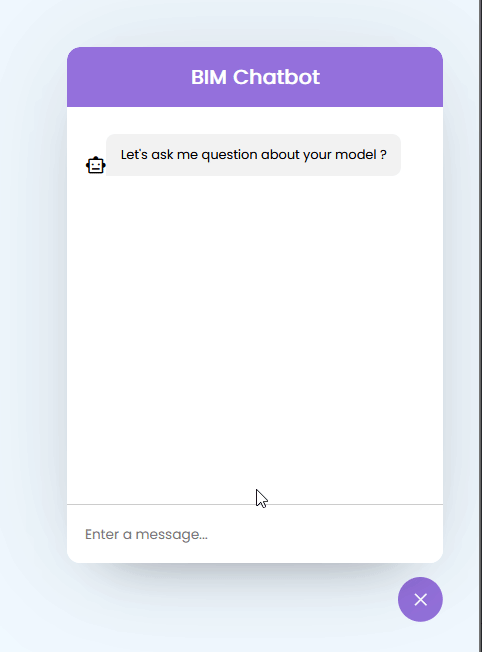

# BIM Chat Bot Sample

# Description

Project allow quick intergration of a chat bot into a web page. The chat bot is a simple question and answer bot that
can be trained to answer questions. The bot is trained using a json file that contains the questions and answers.

# How to use

- Clone the project
- Add OpenAI API key to const in script.js
- Add the questions and view answers

# Demo

